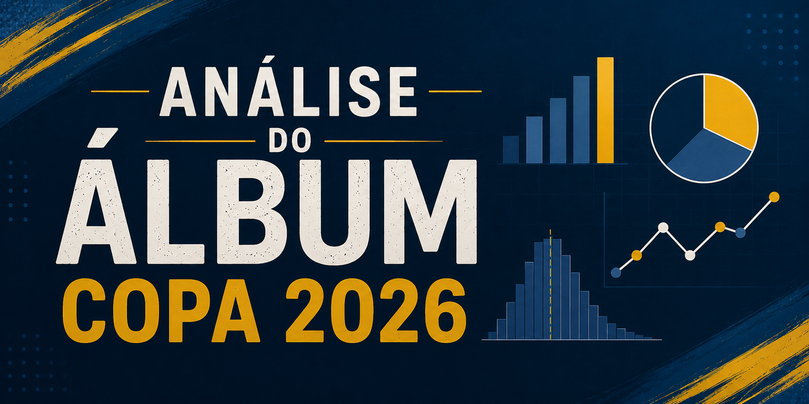
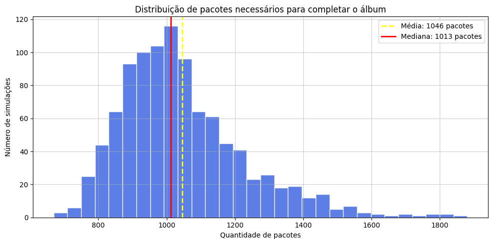
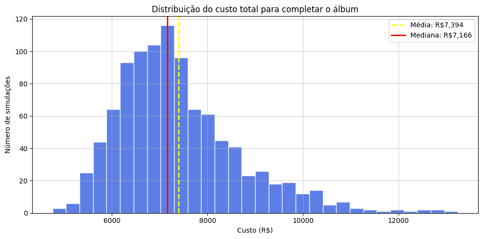
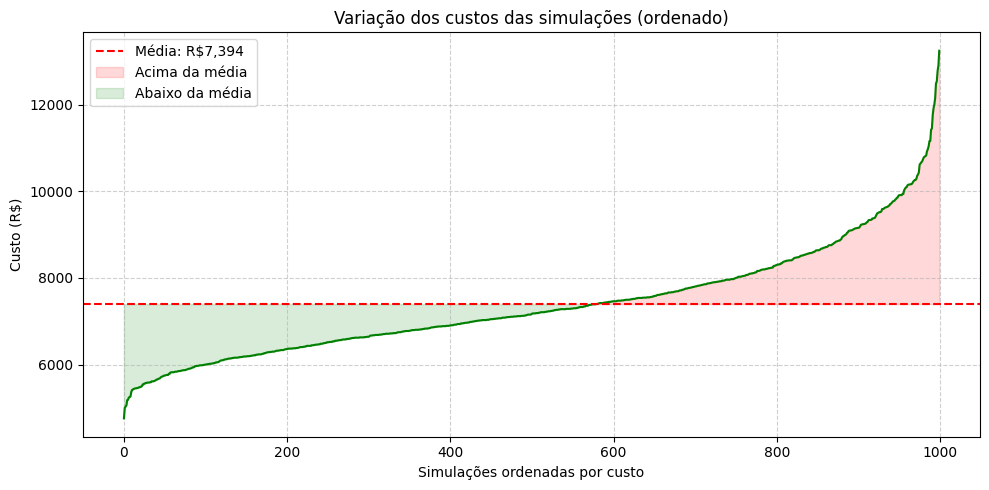
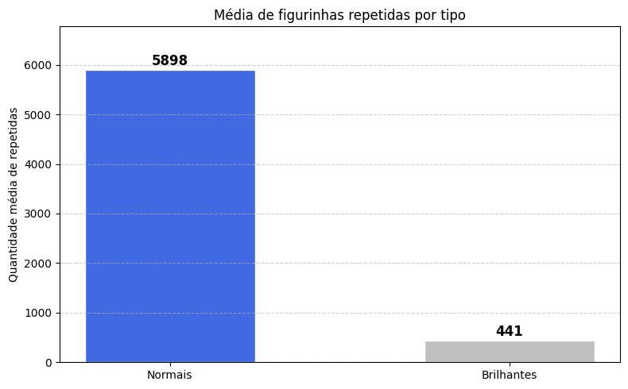

<div align="center">


</div>

---

## 📌 Sobre o projeto

Quanto custa, de verdade, completar um álbum de figurinhas?

Este projeto responde essa pergunta usando **simulação estatística em Python**. Foram executadas **1.000 simulações** completas do processo de completar o álbum da Copa do Mundo 2026, e os resultados foram analisados com Pandas, NumPy e Matplotlib.

A análise considera o modelo real de compra: pacotes com 7 figurinhas aleatórias (com reposição, como acontece na vida real), sem nenhuma troca com outros colecionadores.

---

## 🏆 Resultados principais

| Métrica | Valor |
|---|---|
| **Média de pacotes necessários** | 1.046 pacotes |
| **Custo médio total** | R$ 7.393,00 |
| **Intervalo de confiança 95%** | R$ 7.314 a R$ 7.473 |
| **Melhor caso encontrado** | R$ 4.758,00 |
| **Pior caso encontrado** | R$ 13.242,00 |
| **Figurinhas repetidas (média)** | 6.339 — cerca de 86,6% do total comprado |

> Em média, cada figurinha do álbum é comprada mais de **7 vezes** antes de completar a coleção.

---

## 📊 Visualizações

### Distribuição de pacotes necessários



A distribuição tem cauda à direita, logo, é mais provável gastar muito acima da média do que muito abaixo. A maioria das simulações ficou entre **900 e 1.100 pacotes**.

---

### Distribuição do custo total



Metade das simulações ficou na faixa de **R$ 6.000 a R$ 8.000**. Os outliers chegam a mais de R$ 13.000.

---

### Variação dos custos (ordenado)



A área vermelha (acima da média) tem cauda muito mais longa que a área verde, confirmando a assimetria: quem está com azar paga muito mais do que quem está com sorte poupa.

---

### Repetidas por tipo de figurinha



As figurinhas normais geram **13x mais repetidas** que as brilhantes — resultado esperado, já que são 912 contra apenas 68 figurinhas brilhantes no álbum.

---

## 🃏 Informações do Álbum

| Detalhe | Valor |
|---|---|
| Total de figurinhas | 980 |
| Figurinhas normais | 912 |
| Figurinhas brilhantes | 68 |
| Figurinhas por pacote | 7 |
| Preço por pacote | R$ 7,00 |
| Preço do álbum (capa dura) | R$ 75,00 |
| Número de seleções | 48 |

**Figurinhas brilhantes:**
- Figurinha especial `00`
- Figurinhas `FWC1` a `FWC19`
- Escudos das 48 seleções (`SIGLA1`)

---

## ⚙️ Como a simulação funciona

1. O álbum completo é gerado automaticamente como lista em `album.py`
2. Cada pacote sorteia 7 figurinhas com reposição (`random.choices`)
3. A coleção é armazenada em um `set()` —> estrutura que ignora duplicatas automaticamente
4. O processo repete até o `set` ter 980 elementos (álbum completo)
5. São registrados: pacotes comprados, custo total, repetidas normais e brilhantes

Esse ciclo é executado **1.000 vezes** e os resultados salvos em `data/simulacoes.csv`.

---

## 📁 Estrutura do projeto

```
📁 Analise-Album-Copa2026/
│
├── assets/                    ← imagens para o README
│
├── data/
│   └── simulacoes.csv         ← resultados das 1.000 simulações
│
├── notebooks/
│   └── analise_album_copa2026.ipynb  ← análise completa no Colab
│
├── src/
│   ├── album.py               ← estrutura do álbum
│   ├── simulacao.py           ← lógica de uma simulação
│   └── 1000_simulacoes.py     ← executa 1.000 simulações e salva o CSV
│
├── README.md
└── .gitignore
```

---

## 🚀 Como executar

### 1. Clone o repositório

```bash
git clone https://github.com/Gabriel-Orlandi-Portes/Analise-Album-Copa2026
cd Analise-Album-Copa2026
```

### 2. Instale as dependências

```bash
pip install pandas numpy matplotlib
```

### 3. Execute as simulações

```bash
cd src
python 1000_simulacoes.py
```

O arquivo `data/simulacoes.csv` será atualizado com os novos resultados.

### 4. Abra o notebook

Acesse o notebook no Google Colab ou no VS Code:

```
notebooks/analise_album_copa2026.ipynb
```

> No Colab, faça upload do arquivo `simulacoes.csv` quando solicitado.  
> No VS Code, o notebook lê o CSV diretamente via `../data/simulacoes.csv`.

---

## 🔍 Principais aprendizados

1. **O custo é alto e a variação é grande** — a diferença entre o melhor e o pior caso chega a quase R$ 9.000. A aleatoriedade tem impacto real.

2. **86,6% das figurinhas compradas são repetidas** — o colecionador passa a maior parte do tempo (e dinheiro) comprando cromos que já tem.

3. **As últimas figurinhas são as mais caras** — o custo marginal de cada figurinha nova cresce exponencialmente conforme o álbum se completa. É o *paradoxo do colecionador*.

4. **A distribuição tem cauda à direita** — é mais provável gastar muito acima da média do que muito abaixo. Quem está com azar pode facilmente dobrar o custo típico.

5. **Trocas seriam transformadoras** — com 86% de repetidas, um sistema de trocas eficiente poderia reduzir o custo drasticamente. Análise futura planejada.

---

## 📈 Próximas análises

- [ ] Simular o impacto das trocas no custo final
- [ ] Modelar diferentes probabilidades de raridade para brilhantes
- [ ] Analisar a curva de saturação (figurinhas novas por pacote ao longo do tempo)
- [ ] Comparar custo individual vs. custo em grupo com trocas

---

## 🛠 Tecnologias

- Python 3.10+
- Pandas
- NumPy
- Matplotlib
- Jupyter Notebook / Google Colab
- Git / GitHub

---

##🚀 Observações

Este repositório possui finalidade educacional e pode ser atualizado conforme novos aprendizados ou revisões de conteúdo.

## 👨‍💻 Autor

**Gabriel Orlandi**

Projeto desenvolvido para estudo de Python, simulações estatísticas e análise de dados.
